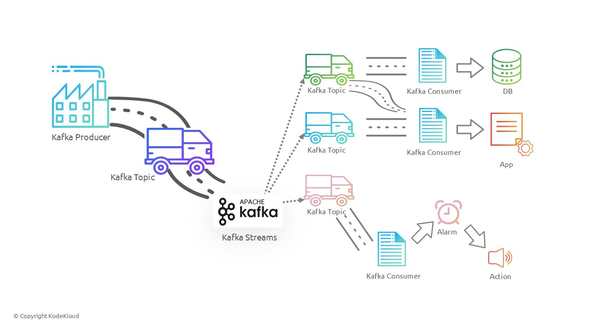

# RBAC_Assignment

## Assignment 1 (With Minikube)

### Step 1: Start Minikube
```
minikube start
kubectl cluster-info #check status
```

### Step 2: Create Admin and Read-Only Roles
Kubernetes already has a built-in ClusterRole called cluster-admin. We’ll use that for the admin user.
Save the following as read-only-role.yaml
```
apiVersion: rbac.authorization.k8s.io/v1
kind: ClusterRole
metadata:
  name: read-only
rules:
- apiGroups: [""]
  resources: ["*"]
  verbs: ["get", "list", "watch"]
```

### Step 3: Create Admin and Baby Users
Kubernetes doesn’t manage normal users directly — but you can simulate users with certificates.

#### 3.1 Generate Certificates
Create a private key for each user:
```
openssl genrsa -out admin.key 2048
openssl genrsa -out baby.key 2048

Create certificate signing requests (CSRs):
openssl req -new -key admin.key -out admin.csr -subj "/CN=admin"
openssl req -new -key baby.key -out baby.csr -subj "/CN=baby"

Sign the CSRs with Minikube’s CA:
minikube ssh "sudo cat /var/lib/minikube/certs/ca.crt" > ca.crt
minikube ssh "sudo cat /var/lib/minikube/certs/ca.key" > ca.key
ls -l ca.crt ca.key
openssl x509 -req -in admin.csr -CA ca.crt -CAkey ca.key -CAcreateserial -out admin.crt -days 365
openssl x509 -req -in baby.csr -CA ca.crt -CAkey ca.key -CAcreateserial -out baby.crt -days 365
```
### Step 4: Configure Kubernetes Users
#### 4.1 Add Users to Kubeconfig
```
kubectl config set-credentials admin \
  --client-certificate=admin.crt \
  --client-key=admin.key

kubectl config set-credentials baby \
  --client-certificate=baby.crt \
  --client-key=baby.key

kubectl config set-context admin-context --cluster=minikube --user=admin
kubectl config set-context baby-context --cluster=minikube --user=baby
```
### Step 5: Bind Roles to Users
Create a ClusterRoleBinding for admin:
```
apiVersion: rbac.authorization.k8s.io/v1
kind: ClusterRoleBinding
metadata:
  name: admin-binding
subjects:
- kind: User
  name: admin
  apiGroup: rbac.authorization.k8s.io
roleRef:
  kind: ClusterRole
  name: cluster-admin
  apiGroup: rbac.authorization.k8s.io
```
Create a ClusterRoleBinding for baby:
```
apiVersion: rbac.authorization.k8s.io/v1
kind: ClusterRoleBinding
metadata:
  name: baby-binding
subjects:
- kind: User
  name: baby
  apiGroup: rbac.authorization.k8s.io
roleRef:
  kind: ClusterRole
  name: read-only
  apiGroup: rbac.authorization.k8s.io
```
### Step 6: Test the Access
#### 6.1 Test as Admin
```
kubectl config use-context admin-context
kubectl get pods --all-namespaces
kubectl create namespace test-ns
kubectl delete namespace test-ns
```
#### 6.2 Test as Baby
```
kubectl config use-context baby-context
kubectl get pods -A # ya,u can
kubectl create namespace test-ns #Forbidden!
```
## Assignment-2
Steps for Setting Up User Access for baby on Another Machine
### Step 1: Generate User Certificates for baby

1. On your admin machine, create a private key and CSR (Certificate Signing Request) for baby:
```
openssl genrsa -out baby.key 2048
openssl req -new -key baby.key -out baby.csr -subj "/CN=baby"
openssl x509 -req -in baby.csr -CA ca.crt -CAkey ca.key -CAcreateserial -out baby.crt -days 365

## Now you have the following files:
1.baby.key (private key)
2.baby.crt (signed certificate)
3.ca.crt (CA certificate)
```
### Step 2: Transfer Certificates to baby Machine
```
scp baby.crt baby.key ca.crt user@baby-machine:/path/to/certs/
```
### Step 3: Configure baby's Kubeconfig on Their Machine
```

kubectl config set-credentials baby --client-certificate=/path/to/certs/baby.crt --client-key=/path/to/certs/baby.key
kubectl config set-context baby-context --cluster=minikube --user=baby
kubectl config use-context baby-context

```
### Step 4: Optional - Enable Remote Access
If your Minikube cluster is running locally and you want baby to access it from a different machine, you need to expose the Minikube API externally.

Set up the Minikube API to be externally accessible by enabling port forwarding or exposing the Kubernetes API server through an external IP. One option is to use minikube tunnel to make Minikube’s Kubernetes cluster accessible.

Run the following on the admin machine:
```
minikube tunnel #This will expose the Minikube API on an external IP (e.g., localhost:8443 or another accessible address).
```
On baby’s machine, update the kubeconfig to point to the external Minikube IP address (e.g., localhost:8443).

```
kubectl config set-cluster minikube --server=https://<minikube-ip>:8443 --certificate-authority=/path/to/certs/ca.crt
```
#### service account (medium)
https://medium.com/@subhampradhan966/implementing-and-verifying-kubernetes-service-accounts-a-step-by-step-guide-c43b727260b2

https://medium.com/@HoussemDellai/rbac-with-kubernetes-in-minikube-4deed658ea7b 

## Assignment-3 (give EC2 access for other-user)
```
 sudo adduser sta --disabled-password
 sudo su - sta
 mkdir ~/.ssh
 chmod 700 ~/.ssh
 ssh-keygen -t rsa -b 2048 -f ~/.ssh/sta_key #it Generate privatekey and publickey
 ls ~/.ssh
 chmod 700 ~/.ssh
 chmod 600 ~/.ssh/sta_key
 chmod 600 ~/.ssh/sta_key.pub
 cat ~/.ssh/sta_key.pub >> ~/.ssh/authorized_keys
 chmod 600 ~/.ssh/authorized_keys
 ls -l ~/.ssh/sta_key
 exit
 sudo cp /home/sta/.ssh/sta_key /home/ubuntu/ #from ubuntu
 sudo chmod 644 /home/ubuntu/sta_key  # Make it readable for download
 sudo chown ubuntu:ubuntu /home/ubuntu/sta_key  # Ensure the file is owned by ubuntu
 scp -i .\original.pem ubuntu@ip:/home/ubuntu/sta_key C:\download\ #from exernal terminal
 ssh -i C:\Users\User\Downloads\sta_key sta@ip

```
## Assignment-4 (SFTP)
```
 sudo apt-get update
 sudo apt-get install openssh-server
 sudo systemctl enable ssh
 sudo systemctl start ssh
 sudo systemctl status ssh
 sudo adduser sftpuser
 sudo mkdir -p /home/sftpuser/uploads
 sudo chown root:root /home/sftpuser
 sudo chmod 755 /home/sftpuser
 sudo chown sftpuser:sftpuser /home/sftpuser/uploads
 sudo nano /etc/ssh/sshd_config

Match User sftpuser
    ForceCommand internal-sftp
    PasswordAuthentication yes
    ChrootDirectory /home/sftpuser
    PermitTunnel no
    AllowAgentForwarding no
    AllowTcpForwarding no
    X11Forwarding no

 sudo systemctl restart ssh
 sftp sftpuser@your-ec2-public-ip

#cron (Transfer to other server)
 ssh ubuntu@ServerA
 ssh-keygen -t rsa -b 4096
 cat ~/.ssh/id_rsa.pub #copy
 ssh ubuntu@ServerB
 echo "PASTE_THE_PUBLIC_KEY_HERE" >> ~/.ssh/authorized_keys
 chmod 600 ~/.ssh/authorized_keys  # option (chmod 700 ~/.ssh)
 
 from ServerA
 ssh ubuntu@ServerB #If it logs in without a password, it’s working! ✅

on ServerA
nano /home/ubuntu/sftp_transfer.sh

#!/bin/bash

SOURCE_DIR="/home/ubuntu/uploads"   # Directory on ServerA
DEST_DIR="/home/ubuntu/backup"      # Directory on ServerB
DEST_USER="ubuntu"
DEST_IP="ServerB"

sftp -i /home/ubuntu/.ssh/id_rsa $DEST_USER@$DEST_IP <<EOF
mkdir -p $DEST_DIR
cd $DEST_DIR
put $SOURCE_DIR/*
bye
EOF

chmod +x /home/ubuntu/sftp_transfer.sh

mkdir -p /home/ubuntu/backup #on ServerB
chown ubuntu:ubuntu /home/ubuntu/backup
chmod 755 /home/ubuntu/backup

/home/ubuntu/sftp_transfer.sh #manual running(ServerA)

ssh ubuntu@ServerB
ls /home/ubuntu/backup

```
## Assignment-4 (Kafka)
### Core Components of Apache Kafka


- Producer: Producers are applications that send records to Kafka topics. They are responsible for choosing which partition within the topic the record should be sent to.
- Consumer: Consumers are applications that read records from Kafka topics. Consumers subscribe to topics and process the messages in real time.
- Broker: A Kafka broker is a server that runs Kafka. Brokers receive messages from producers, store them on disk, and serve them to consumers. A Kafka cluster consists of multiple brokers to ensure load balancing and fault tolerance.
- Topic: A topic is a logical channel to which producers send records and from which consumers read. Topics are partitioned for scalability and parallelism.
- Partition: Each topic is divided into partitions, which are ordered, immutable sequences of records. Partitions allow Kafka to scale horizontally and maintain the order of records within each partition.
- ZooKeeper: Kafka uses Apache ZooKeeper for distributed coordination, configuration management, and leader election for Kafka brokers and topics.

### Kafka Architecture
Kafka's architecture revolves around topics, partitions, and brokers. Here's a breakdown of the key architectural elements:
- Topics and Partitions: Topics are divided into partitions, which are the fundamental unit of parallelism and scalability in Kafka. Each partition is an ordered, immutable sequence of records, and each record within a partition is assigned a unique offset. Partitions enable Kafka to scale by distributing data and load across multiple brokers.
- Producers and Consumers: Producers write data to Kafka topics, and consumers read data from topics. Kafka supports a publish-subscribe model where multiple consumers can subscribe to the same topic and process the data independently.
- Brokers and Clusters: Kafka brokers are responsible for storing and serving data. A Kafka cluster consists of multiple brokers, which ensures fault tolerance and high availability. Brokers are distributed across different machines to prevent data loss in case of hardware failures.
- ZooKeeper Coordination: ZooKeeper manages the configuration and coordination of Kafka brokers. It helps in leader election for partitions and keeps track of broker metadata. However, newer versions of Kafka (starting from version 2.8) are moving towards removing ZooKeeper dependency with the introduction of the KRaft mode.

## Assignment-5 (Linux Challenges)

```
sudo -i
yum install -y lvm2
groupadd dba_users
usermod -G dba_users bob
pvcreate /dev/vdb #Create a Physical Volume for "/dev/vdb"
pvcreate /dev/vdc #Create a Physical Volume for "/dev/vdc"
vgcreate dba_storage /dev/vdb /dev/vdc #Create a volume group called "dba_storage" using the physical volumes "/dev/vdb" and "/dev/vdc"
lvcreate -n volume_1 -l 100%FREE dba_storage
mkfs.xfs /dev/dba_storage/volume_1 #Format the lvm volume "volume_1" as an "XFS" filesystem

#Mount the filesystem at the path "/mnt/dba_storage".
mkdir -p /mnt/dba_storage
mount -t xfs /dev/dba_storage/volume_1 /mnt/dba_storage
echo "/dev/mapper/dba_storage-volume_1 /mnt/dba_storage xfs defaults 0 0" >> /etc/fstab
chown :dba_users /mnt/dba_storage
chmod 770 /mnt/dba_storage

```
#### Challenges-2
```
sudo su -
sed '1inameserver 8.8.8.8' /etc/resolv.conf > /tmp/resolv.conf
yum install -y nginx firewalld
systemctl enable firewalld
systemctl start firewalld
# Add firewall rules to allow only incoming port "22", "80" and "8081" and make permanent
firewall-cmd --zone=public --add-port=80/tcp --permanent
firewall-cmd --zone=public --add-port=8081/tcp --permanent
firewall-cmd --zone=public --add-port=22/tcp --permanent
firewall-cmd --reload

pushd /home/bob/go-app
nohup go run main.go &

# Wait for it to be running (usually 15-20 seconds as it has to compile first)
while ! ps -faux | grep -P '/tmp/go-build\d+/\w+/exe/main'
do
    sleep 2
done
sleep 2
popd

# Configure Nginx as a reverse proxy for the GoApp so that we can access the GoApp on port "80"
# Do this by inserting a proxy_pass line after "location / {" at line 48
sed -i '48i\            proxy_pass  http://localhost:8081;' /etc/nginx/nginx.conf

# Start nginx
systemctl enable nginx
systemctl start nginx
systemctl status nginx

```
## Monitoring

https://medium.com/@sariiersinn13/install-loki-promtail-and-grafana-on-kubernetes-2a19ffcb7f26

https://medium.com/@dikshantdevops/implement-complete-monitoring-stack-from-scratch-3b0262b7690f

https://medium.com/aws-in-plain-english/monitoring-your-kubernetes-cluster-a-beginners-guide-to-setting-up-prometheus-and-grafana-e691b1538fa0

#


